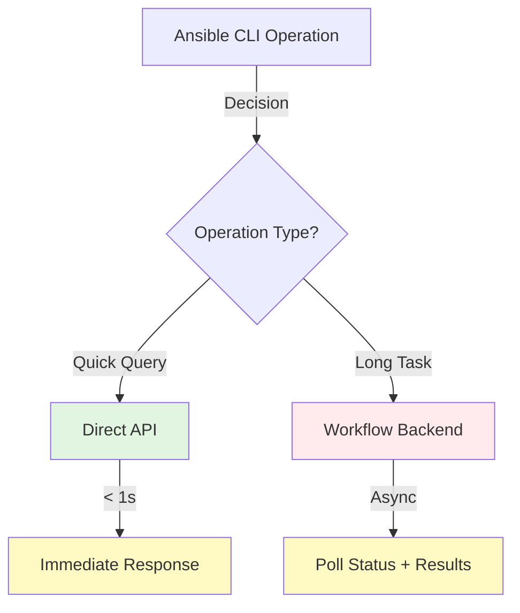

# GitHub Workflows as Ansible Backend? 🤔

**Architecture Comparison & Performance Analysis**

Based on 21 sprints of GitHub API experience

---

## Two Architecture Models

### Model A: Direct API (Sprint 21 - Current Design) ⚡

**Flow**: `CLI → gh CLI → GitHub API → Response`

**Latency**: **< 1 second** (typical)

**Characteristics**:
- Synchronous operation
- Immediate feedback
- Suitable for interactive CLI
- Example: List PRs, create issue, check status

---

### Model B: Workflow Backend (Analyzed Alternative) 🐌

**Flow**: `CLI → Trigger → Correlate → Poll → Execute → Retrieve`

**Latency**: **10-15+ seconds** (minimum, even for empty workflow)

**Characteristics**:
- Asynchronous operation
- Noticeable delay
- User waits for feedback
- Example: Heavy compute via GitHub runners

---

## Performance Comparison (Actual Measurements)

| Operation | Direct API | Workflow Backend | Overhead |
|-----------|------------|------------------|----------|
| **Simple Query** (list PRs) | **< 1s** | **~15s** | **15x slower** |
| **Trigger Workflow** | **< 1s** | **~15s** | **15x slower** |
| **Get Run Status** | **< 1s** | **~15s** | **15x slower** |
| **Long Task** (5 min job) | **N/A** | **~5m 15s** | **+15s overhead** |

**Data Sources**:
- Sprint 3.1: Workflow correlation ~2-5s
- Sprint 5.1: Log retrieval ~5-15s
- Sprint 20: Workflow overhead ~10s minimum
- Sprints 15-20: Direct API < 1s

**Key Finding**: Workflow backend adds **constant 10-15 second overhead** regardless of task complexity.

---

## Use Case Decision Matrix

| Requirement | Direct API ✅ | Workflow Backend ✅ | Recommended |
|-------------|---------------|---------------------|-------------|
| **Rapid query** (< 5s response) | Yes | No | **Direct API** |
| **Interactive CLI** (user waiting) | Yes | No | **Direct API** |
| **Frequent operations** | Yes | No | **Direct API** |
| **Long-running task** (> 5 min) | Limited | Yes | **Workflow** |
| **Parallel execution at scale** | API limits | Yes | **Workflow** |
| **Audit trail** (GitHub UI) | Limited | Yes | **Workflow** |
| **Resource isolation** | Local | Runner | **Workflow** |
| **Cross-platform builds** | Limited | Matrix | **Workflow** |

**Architecture Decision**:
- **Sprint 21 Design** (Direct API): ✅ **Correct for synchronous CLI operations**
- **Workflow Backend**: ✅ **Valid for specific async use cases**

---

# Workflow Backend: Pros & Cons ⚖️

**Evaluating GitHub Workflows as Execution Backend for CLI-Driven Ansible**

---

## Top 5 Advantages (Pros) 👍

| # | Advantage | Context | When It Matters |
|---|-----------|---------|-----------------|
| **1** | **Execution Isolation** | Runs on GitHub runners, not local machine | Resource-intensive tasks, clean environment |
| **2** | **Audit Trail** | Complete visibility in GitHub Actions UI | Compliance, troubleshooting, team transparency |
| **3** | **Parallel Execution** | GitHub infrastructure handles concurrency | Massive scale (100s of jobs), batch processing |
| **4** | **Cross-Platform** | Runner matrix: Linux/macOS/Windows | Multi-OS validation, platform-specific builds |
| **5** | **Built-in Features** | Retry logic, secrets, caching, artifacts | Complex orchestration, stateful workflows |

**Additional Pros**:
- Rate limiting handled by GitHub (workflow queue)
- No local resource consumption
- Container support built-in
- Integration with GitHub ecosystem (PR status checks, notifications)

---

## Top 5 Disadvantages (Cons) 👎

| # | Disadvantage | Impact | When It Matters |
|---|--------------|--------|-----------------|
| **1** | **Latency Overhead** | +10-15s minimum, even for trivial tasks | **Interactive CLI (deal-breaker)** |
| **2** | **Asynchronous Nature** | User must wait, poll, or callback | CLI user experience expectation |
| **3** | **Correlation Complexity** | Must track run_id across async boundary | Error-prone, adds code complexity |
| **4** | **Cost** | Consumes GitHub Actions minutes | Frequent small operations expensive |
| **5** | **Local Testing** | Cannot test without pushing to GitHub | Development workflow friction |

**Additional Cons**:
- Workflow dispatch rate limit: 1000/hour
- Result retrieval adds complexity (artifacts or API)
- Debugging harder (logs not local)
- Dependency on GitHub availability
- Limited to GitHub-supported runner OSes

---

## Recommendation: Hybrid Approach 🎯

---

## Recommended Strategy

**1. Default: Direct API** (Sprint 21 Design)
   - Use for: Queries, CRUD operations, rapid actions
   - Latency: < 1 second
   - User experience: Synchronous, feels instant
   - **Validates Sprint 21 architecture ✅**

**2. Specific Use Cases: Workflow Backend**
   - Use for: Long-running compute (> 5 min), cross-platform builds, audit-critical operations
   - Latency: Acceptable (task is long anyway)
   - User experience: Async with progress updates
   - **Complementary to Sprint 21 ✅**

**Implementation Guidance**:
- Sprint 21 Ansible Collection roles: Keep direct API approach ✅
- Future backlog: Add workflow orchestration role for long-running tasks
- Hybrid module: Role parameter selects backend (advanced feature)

---

## Key Takeaway 💡

**"Right Tool for the Right Job"**

- ✅ **GitHub Workflows**: Excellent for **long-running, isolated, auditable** tasks
- ✅ **Direct API** (Sprint 21): Correct for **synchronous CLI operations**
- ❌ **Workflows as General Backend**: Unsuitable due to **latency impact on CLI UX**

**Sprint 21 Validation**: Ansible Collection design using direct API via gh CLI is **architecturally sound** for CLI-driven GitHub automation.

**Future Opportunity**: Workflow backend remains valuable for **specific async use cases** (separate roles, not replacement).

---

## Questions?

📊 **Data**: 21 sprints of GitHub API experience
📐 **Architecture**: Sprint 21 Ansible Collection design
🎯 **Analysis**: Comprehensive pros/cons with context

**Documentation**:
- Full analysis: `progress/sprint_22/sprint_22_analysis.md`
- Design details: `progress/sprint_22/sprint_22_design.md`
- Implementation: `progress/sprint_22/sprint_22_implementation.md`

---

**Sprint 22 - GH-30**
*Analysis: GitHub Workflows as Backend for CLI-Driven Ansible*
*Delivered: 2025-11-12*
