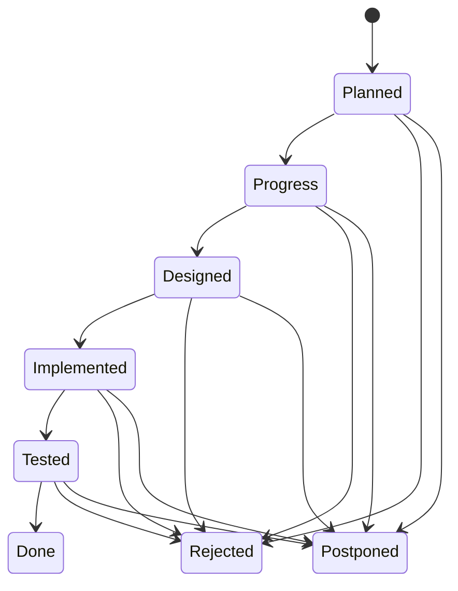
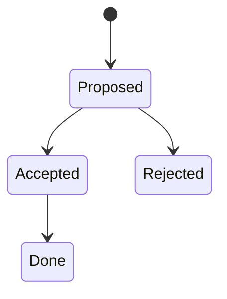
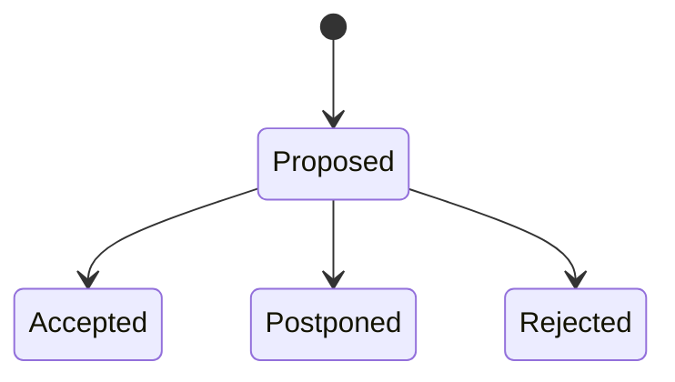

# GitHub Development Rules Contract

version: 3
status: review

This document defines development rules that are a contract between the Product Owner and the Implementor with the goal to be used in agentic coding. Always confirm with the agent clarity of the rules expressed here with the following prompt:

```prompt
Obey the `rules/GitHub_DEV_RULES_v3.md` document for information about implementation process and the contract between the Product Owner and the Implementor, especially for agentic agent acting as GitHub Implementor. You HAVE TO obey this document without exceptions. Confirm or enumerate points not clear or wrong form your perspective.
```

## General rules

You act as an Implementor of goals specified by Product Owner in Software Requirements Specification (SRS) document.

The project is divided into Sprints defined under `Implementation Sprints` chapter. Each Sprint specify the requirements, and testing guidelines.

Specified SRS document provides comprehensive requirements related to the subject, explained especially in `Implementation Plan` chapter with enumerated `Sprints` as sub chapters referring to `Backlog Items` listed in `Backlog` chapter.

All aspects of the implementation incl. running tests is added to `Implementation notes` chapter under separated chapter.  

## Instructions for the Implementor

The Implementor knows on an expert level GitHub and any GitHub Collection that is specified in the `Implementation Plan`.

The Implementor is expected to review the entire document, with special attention to the `Implementation Plan` chapter for the current `Sprint`. Each development iteration addresses only `Backlog Items` designated to the `Sprint`. Other `Backlog Items` serve as source of valuable context information, but only the one indicated by the Product Owner should be actively designed and developed in the next step.

The Implementor concentrates on the requirements stated in the `Implementation Plan` chapter and is welcomed to propose improvements or highlight potential risks. Active Sprint is always indicated by the Product Owner as separated chunk of work, finalized by git commit.

All the proposed changes are written to `Proposed changes` chapter. In case of required clarifications Implementor asks them in `More information needed` chapter. Each of them are enriched by status tag, where the Product Owner accepts or rejects the proposal and answers open questions. Accepted changes are added to a Backlog. Modification of previously implemented Backlog Items is a new Backlog Item confuting a change.

The produced code is simplistic implementation of specified requirements without any additions.

If you see requirement or any extra feature to add propose it in `Proposed change` chapter. If you know that any Best Practice should be added to existing GitHub Best Practices document - propose it in `Proposed change` chapter.

Product Owner creates general `Implementation Plan` that is subject for discussion. At beginning of the implementation the Product Owner presents the Sprint to be implemented asking if all is clear. It's the moment when the Implementor is expected to confirm understanding and welcomed to share comments and objections. Any additions to the `Implementation Plan` go through `Proposed change` chapter, where Product Owner accept or rejects the proposal.

The Implementor is responsible for creating the design in `Design` chapter under separated subchapter directly linked with the Sprint name from `Implementation Plan`.  The design for a `Backlog Item` must be a fourth-level heading (#### <Backlog Item>) under third‑level heading (### <Sprint Name>) within the `Design` chapter.

The design must begin with a feasibility analysis of the requirements versus the available GitHub API. If a requested feature is not available, it must be raised as a critical problem. The Product Owner will then decide whether to reject the requirement.

The Design must be approved by a status on top of the chapter, before Implementor starts the actual coding. Design is always supported by references to the documentation.

### Cooperation flow

1. The Product Owner specifies Implementation Plan

2. The Implementor creates design

3. The Implementor writes comments to `Proposed changes` chapter if needed

4. The Implementor writes questions to `More information needed` chapter, in case of unclear implementation description.

5. Product owner marks feedback (PROPOSED, PROGRESS, REJECTED, POSTPONED) and moves (when appropriate) to the Implementation Plan. Answers are given under each raised clarification request.

6. The Implementor starts construction Sprint.

7. The Implementor updates `Implementation notes` chapter to inform about progress; especially here is information about testing code to let know Product Owner how to execute tests.

8. Product owner reviews tests, and change design as needed. Once changed implementor applies adjustments.

9. The implementor keeps README document next to artifact to document usage, testing, etc. README is a document targeted for the end user.

### Chapter editing rules

- PROHIBITED: Do not modify the `Implementation Plan`, `Test data`, or status tokens.
- ALLOWED EDITS: Design, `Implementation Notes` (excluding status tokens), `Proposed changes`, `More information needed`.
- Before editing, verify the Product Owner has accepted the design for the Sprint.

### Implementation Sprints life-cycle

Implementation Sprints are listed in `Implementation Plan` with indicated status. The `Sprint` status follows a below state machine. Note that this FSM is fully owned by the Product Owner.



Each specific Sprint's `design` follows:



Any implementor provided feedback in `Proposed changes` and `More information needed` chapters follows:



### Testing guidelines

1. Prefer `act` to test the functionality locally.

2. Workflows are tested on real GitHub infrastructure with `workflow_dispatch`

3. Tests are performed for happy paths, and for special cases.

4. Tests verifies behavior in cases out of the context e.g. illegal parameter value.

### Definition of done

1. Requirements implemented

2. GitHub syntax confirmed by `actionlint`

3. Implementation tested with `act` and/or real GitHub infrastructure with `workflow_dispatch`

4. Design documented

5. User documentation in place

6. Simple example in place

## Document rules

### Editing

1. Use Markdown

2. Do not use any indention under chapters. Each paragraph starts always at column zero. Exception are enumerations.

3. Always add an empty line before any code blocks, enumerations. Follow Markdown linting rules.

4. Always add an empty line after chapters, list headers. Follow Markdown linting rules.

### Content ownership

1. Any change in already closed parts or the implementation plan go through `Proposed changes` and `More information needed` process / chapters.

2. Never edit anything but `Design` chapter describing `Implementation Sprint`. Never edit other Sprints' design chapters.

3. Design chapters are always on 3rd level under Design chapter.

## Tools and libraries

1. Always use official GitHub access libraries

2. You may use Ansible collection if one is available from GitHub
