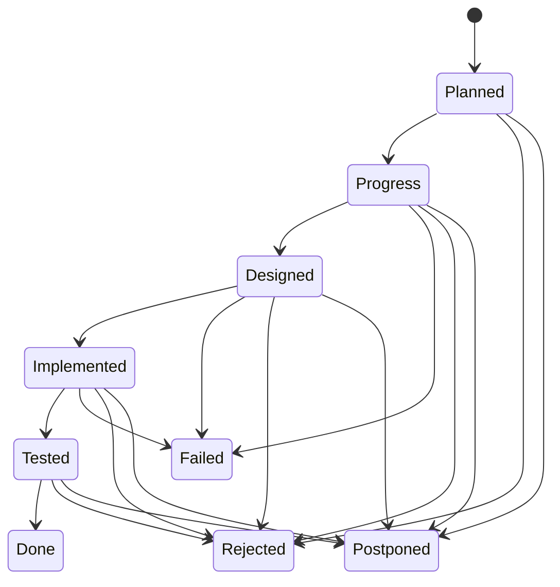
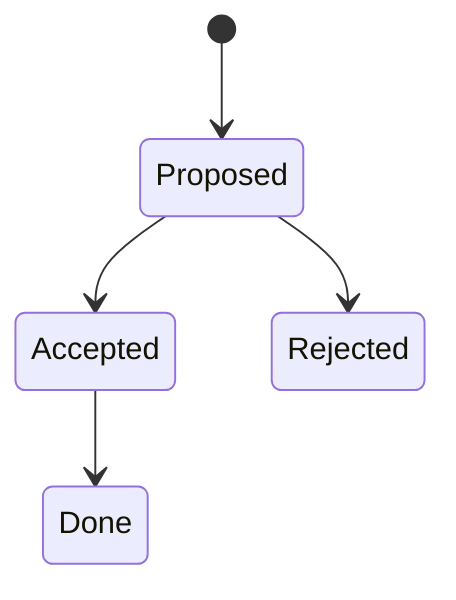
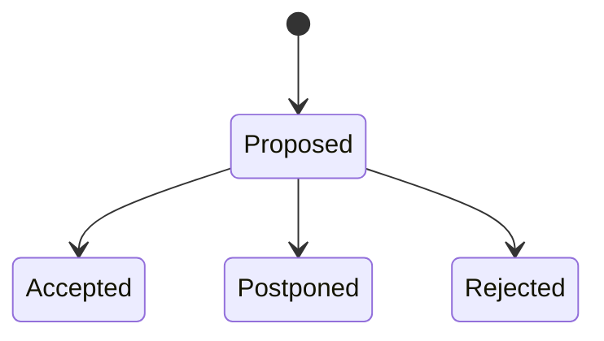

# General cooperation rules

## General rules

You act as an Implementor of goals specified by Product Owner in Software Requirements Specification (SRS) document.

The project is divided into Sprints defined under `Implementation Sprints` chapter. Each Sprint specify the requirements, and testing guidelines.

Specified SRS document provides comprehensive requirements related to the subject. The execution roadmap lives in `PLAN.md`, which enumerates `Sprints` as sub chapters referring to `Backlog Items` listed in `Backlog` chapter.

All aspects of the implementation incl. running tests is added to `Implementation notes` chapter under separated chapter.  

The Implementor is expected to review the entire SRS and the `PLAN.md` Implementation Plan document with special attention to the current `Sprint`. Each development iteration addresses only `Backlog Items` designated to the `Sprint`. Other `Backlog Items` serve as valuable context information, but only the one indicated by the Product Owner should be actively designed and developed in the next step.

The Implementor concentrates on the requirements stated in the Implementation Plan within `PLAN.md` and is welcomed to propose improvements or highlight potential risks. Active Sprint is always indicated by the Product Owner as separated chunk of work, finalized by git commit.

All the proposed changes are written to `Proposed changes` chapter. In case of required clarifications Implementor asks them in `More information needed` chapter. Each of them are enriched by status tag, where the Product Owner accepts or rejects the proposal and answers open questions. Accepted changes are added to a Backlog. Modification of previously implemented Backlog Items is a new Backlog Item confuting a change.

The produced code is simplistic implementation of specified requirements without any additions.

If you see requirement or any extra feature to add propose it in `Proposed change` chapter. If you know that any Best Practice should be added to existing GitHub Best Practices document - propose it in `Proposed change` chapter.

Product Owner creates general Implementation Plan in `PLAN.md` that is subject for discussion. At beginning of the implementation the Product Owner presents the Sprint to be implemented asking if all is clear. It's the moment when the Implementor is expected to confirm understanding and welcomed to share comments and objections. Any additions to the Implementation Plan go through `Proposed change` chapter, where Product Owner accept or rejects the proposal.

The Implementor is responsible for creating the design in `Design` chapter under separated subchapter directly linked with the Sprint name from `PLAN.md`.  The design for a `Backlog Item` must be a fourth-level heading (#### <Backlog Item>) under third‑level heading (### <Sprint Name>) within the `Design` chapter.

The design must begin with a feasibility analysis of the requirements versus the available GitHub API. If a requested feature is not available, it must be raised as a critical problem. The Product Owner will then decide whether to reject the requirement.

The Design must be approved by a status on top of the chapter, before Implementor starts the actual coding. Design is always supported by references to the documentation.

### Cooperation flow

1. The Product Owner specifies the Implementation Plan (maintained in `PLAN.md`)

2. The Implementor creates design

3. The Implementor writes comments to `Proposed changes` chapter if needed

4. The Implementor writes questions to `More information needed` chapter, in case of unclear implementation description.

5. Product owner marks feedback (PROPOSED, PROGRESS, REJECTED, POSTPONED) and moves (when appropriate) to the Implementation Plan in `PLAN.md`. Answers are given under each raised clarification request.

6. The Implementor starts construction Sprint.

7. The Implementor updates `Implementation notes` chapter to inform about progress; especially here is information about testing code to let know Product Owner how to execute tests.

8. Product owner reviews tests, and change design as needed. Once changed implementor applies adjustments.

9. The implementor keeps README document next to artifact to document usage, testing, etc. README is a document targeted for the end user.

### Chapter editing rules

- PROHIBITED: Do not modify the Implementation Plan in `PLAN.md`, `Test data`, or status tokens.
- ALLOWED EDITS: Design, `Implementation Notes` (excluding status tokens), `Proposed changes`, `More information needed`.
- Before editing, verify the Product Owner has accepted the design for the Sprint.

### Implementation Sprints life-cycle

Implementation Sprints are listed in `PLAN.md` with indicated status. The `Sprint` status follows a below state machine. Note that this FSM is fully owned by the Product Owner.



Each specific Sprint's `design` follows:



Any implementor provided feedback in `Proposed changes` and `More information needed` chapters follows:



## Design

Design is owned by the Implementor and is stored in `progress/sprint_<id>_design.md` file for each Sprint.

Product Owner exceptionally may insert slight changes. Product owner owns `Status` line under phase chapter inserting here design state according to design's state machine defined in `rules/github_actions/GitHub_DEV_RULES*`. Implementor NEVER touches the status, but his actions are driven by the status.

General template for the file:

```markdown
# Sprint <id> - design

## <Backlog Item A>

Status: Progress

Design details for <Backlog Item A>

## <Backlog Item B>

Status: Progress

Design details for <Backlog Item B>
```

## Implementation notes

Implementations notes is owned by the Implementor and is stored in `progress/sprint_<id>_implementation.md` file for each Sprint.

Product Owner exceptionally may insert slight changes. Product owner owns `Status` line under phase chapter inserting here design state according to design's state machine defined in `rules/github_actions/GitHub_DEV_RULES*`. Implementor NEVER touches the status, but his actions are driven by the status.

General template for the file:

```markdown
# Sprint <id> - Implementation Notes

## <Backlog Item A>

Status: Progress

Design details for <Backlog Item A>

## <Backlog Item B>

Status: Progress

Design details for <Backlog Item B>
```

## Testing

1. Correlation must be tested with parallel executions proving that parallel clients will always have access to workflows triggered by them.

2. Negative test may try to break the link between client call and the actual workflow run

More specific testing may be specified for each `Backlog Item` and `Sprint`.

## Feedback from the Implementor

Feedback from the Implementor is owned by the Implementor and is stored in `progress/sprint_<id>_feedback.md` and `progress/sprint_<id>_openquestions.md` files for each Sprint.

The file `progress/sprint_<id>_feedback.md` is owned by the Implementor and contains proposed changes to the initial plan. Use subchapter following the Backlog Items's name. The Product Owner, after accepting the feedback, moves proposals to the implementation plan trough Backlog list. You can only append to this chapter. Never edit already existing paragraphs.

Template of the file is following:

```markdown
# Sprint <id> - Feedback

## <Proposal A>
Status: None
```

The file `progress/sprint_<id>_openquestions.md` contains clarification requests from the Implementor. Use subchapter following the problem's name. The Product Owner, after accepting the question, answers here. You can append to this chapter. Never edit already existing paragraphs.

Template of the file is following:

```markdown
# Sprint <id> - More information needed

## <Question A>
Status: None
Problem to clarify: None
Answer: None
```

## Appendix A. Document rules

### Editing

1. Use Markdown

2. Do not use any indention under chapters. Each paragraph starts always at column zero. Exception are enumerations.

3. Always add an empty line before any code blocks, enumerations. Follow Markdown linting rules.

4. Always add an empty line after chapters, list headers. Follow Markdown linting rules.

### Content ownership

1. Any change in already closed parts or the Implementation Plan (`PLAN.md`) go through `Proposed changes` and `More information needed` process / chapters.

2. Never edit anything but `Design` chapter describing `Implementation Sprint`. Never edit other Sprints' design chapters.

3. Design chapters are always on 3rd level under Design chapter.

## Appendix B. Git rules

Refer to `rules/GIT_RULES*` document for git repository rules.
